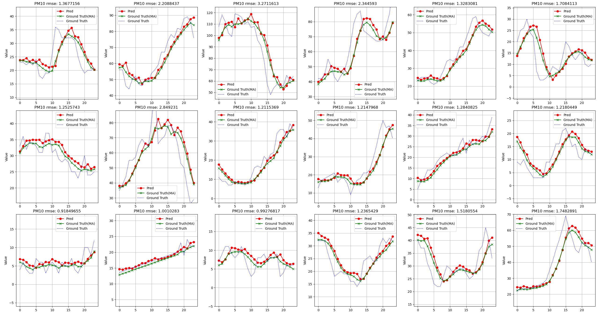
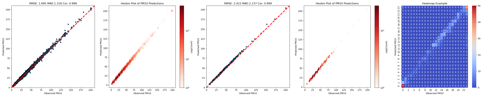
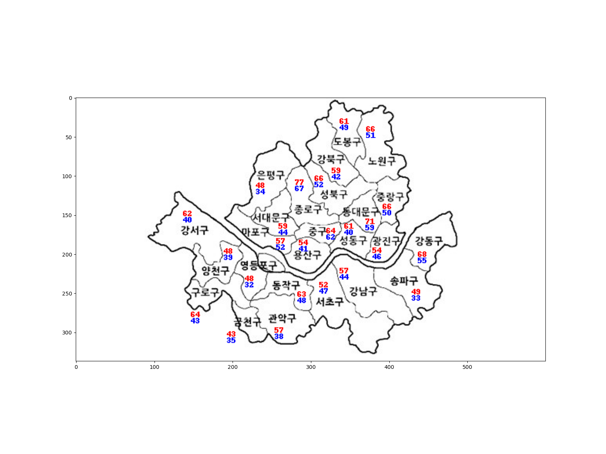

# PM10 Time-Series Forecasting Project

### **Overview**
This project develops a deep learning-based time-series prediction model for PM10 concentrations in Seoul, South Korea. The model improves PM10 and PM2.5 prediction accuracy, addressing their impact on public health. Historical data from Seoul’s 25 districts are used to forecast PM10 concentrations for the next 24 hours, with a specific focus on Jung-gu.

---

### **Dataset**
- **Source**: Air quality monitoring stations in Seoul.
- **Timeframe**: 2008–2022.
- **Features**: 
  - PM10 and PM2.5 concentrations.
- **Preprocessing**: 
  - Linear interpolation for missing values.
  - Normalization with a custom MinMaxScaler.
  - Segmented time-series dataset creation.

---

### **Key Results**

#### 1. **Scatter and Hexbin Plots**
These visualizations highlight the model's performance with metrics such as RMSE, MAE, and correlation values.

| Scatter Plot and Hexbin Plot (Model Predictions) |
|--------------------------------------------------|
|     |

#### 2. **Time-Series Predictions**
Comparison of predicted vs. actual PM10 levels across multiple districts.

| Time-Series Predictions |
|-------------------------|
|  |

#### 3. **Spatial Analysis**
Visualization of PM10 distributions across Seoul’s districts, emphasizing spatial patterns.

| PM10/2.5 Spatial Distribution |
|---------------------------|
|  |

---

### **Research Highlights**
1. **Data**:
   - Used PM10 and PM2.5 data from Jung-gu and neighboring districts.
   - Focused on daily average PM10 predictions for the next day.

2. **Deep Learning Approach**:
   - A hybrid CNN-LSTM model was utilized to capture both spatial and temporal features.
   - Extensive hyperparameter tuning was performed to enhance model accuracy.

3. **Evaluation Metrics**:
   - Root Mean Squared Error (RMSE).
   - Mean Absolute Error (MAE).
   - Correlation Coefficient.

---

### **Future Directions**
- Integrate meteorological data (e.g., wind speed, temperature) for multi-feature predictions.
- Extend the model to predict long-term PM trends.
- Apply explainability techniques for better insights into the predictions.

